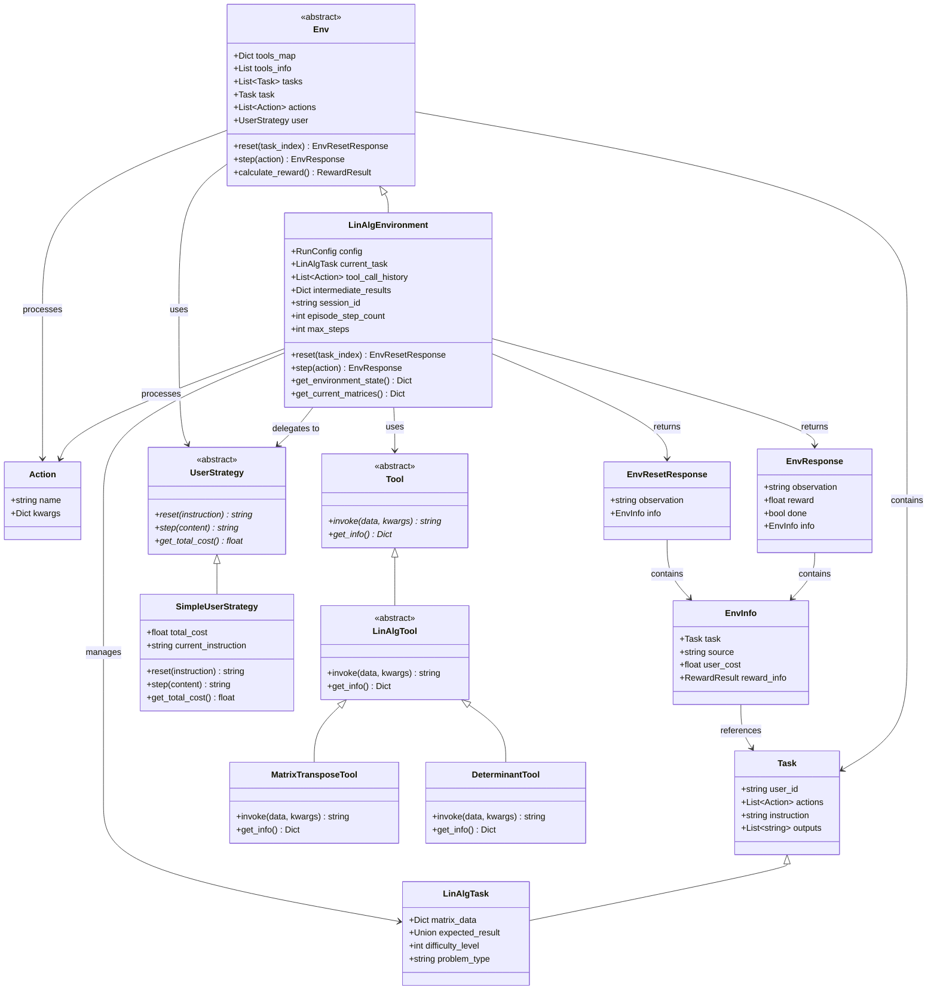
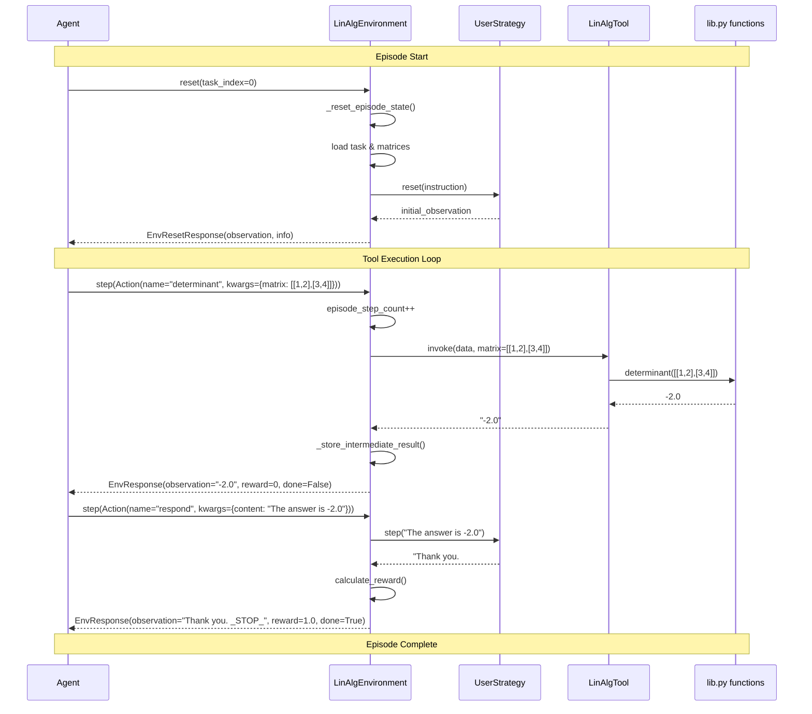
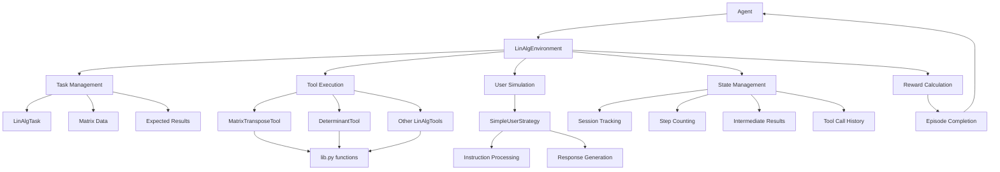

- https://www.mermaid.live/

```mermaid
classDiagram
    %% Base Types
    class Action {
        +string name
        +Dict kwargs
    }

    class Task {
        +string user_id
        +List~Action~ actions
        +string instruction
        +List~string~ outputs
    }

    class EnvResponse {
        +string observation
        +float reward
        +bool done
        +EnvInfo info
    }

    class EnvResetResponse {
        +string observation
        +EnvInfo info
    }

    class EnvInfo {
        +Task task
        +string source
        +float user_cost
        +RewardResult reward_info
    }

    %% Abstract Base Classes
    class Tool {
        <<abstract>>
        +invoke(data, kwargs)* string
        +get_info()* Dict
    }

    class UserStrategy {
        <<abstract>>
        +reset(instruction)* string
        +step(content)* string
        +get_total_cost()* float
    }

    class Env {
        <<abstract>>
        +Dict tools_map
        +List tools_info
        +List~Task~ tasks
        +Task task
        +List~Action~ actions
        +UserStrategy user
        +reset(task_index) EnvResetResponse
        +step(action) EnvResponse
        +calculate_reward() RewardResult
    }

    %% Concrete Implementations
    class SimpleUserStrategy {
        +float total_cost
        +string current_instruction
        +reset(instruction) string
        +step(content) string
        +get_total_cost() float
    }

    class LinAlgTask {
        +Dict matrix_data
        +Union expected_result
        +int difficulty_level
        +string problem_type
    }

    class LinAlgEnvironment {
        +RunConfig config
        +LinAlgTask current_task
        +List~Action~ tool_call_history
        +Dict intermediate_results
        +string session_id
        +int episode_step_count
        +int max_steps
        +reset(task_index) EnvResetResponse
        +step(action) EnvResponse
        +get_environment_state() Dict
        +get_current_matrices() Dict
    }

    class LinAlgTool {
        <<abstract>>
        +invoke(data, kwargs) string
        +get_info() Dict
    }

    class MatrixTransposeTool {
        +invoke(data, kwargs) string
        +get_info() Dict
    }

    class DeterminantTool {
        +invoke(data, kwargs) string
        +get_info() Dict
    }

    %% Relationships
    Task <|-- LinAlgTask
    Env <|-- LinAlgEnvironment
    Tool <|-- LinAlgTool
    LinAlgTool <|-- MatrixTransposeTool
    LinAlgTool <|-- DeterminantTool
    UserStrategy <|-- SimpleUserStrategy

    LinAlgEnvironment --> LinAlgTask : manages
    LinAlgEnvironment --> Tool : uses
    LinAlgEnvironment --> UserStrategy : delegates to
    LinAlgEnvironment --> Action : processes
    LinAlgEnvironment --> EnvResponse : returns
    LinAlgEnvironment --> EnvResetResponse : returns

    Env --> Task : contains
    Env --> Action : processes
    Env --> UserStrategy : uses

    EnvResponse --> EnvInfo : contains
    EnvResetResponse --> EnvInfo : contains
    EnvInfo --> Task : references
```

```mermaid
sequenceDiagram
    participant Agent
    participant LinAlgEnvironment
    participant UserStrategy
    participant Tool as LinAlgTool
    participant LibFunction as lib.py functions

    Note over Agent, LibFunction: Episode Start

    Agent->>LinAlgEnvironment: reset(task_index=0)
    LinAlgEnvironment->>LinAlgEnvironment: _reset_episode_state()
    LinAlgEnvironment->>LinAlgEnvironment: load task & matrices
    LinAlgEnvironment->>UserStrategy: reset(instruction)
    UserStrategy-->>LinAlgEnvironment: initial_observation
    LinAlgEnvironment-->>Agent: EnvResetResponse(observation, info)

    Note over Agent, LibFunction: Tool Execution Loop

    Agent->>LinAlgEnvironment: step(Action(name="determinant", kwargs={matrix: [[1,2],[3,4]]}))
    LinAlgEnvironment->>LinAlgEnvironment: episode_step_count++
    LinAlgEnvironment->>Tool: invoke(data, matrix=[[1,2],[3,4]])
    Tool->>LibFunction: determinant([[1,2],[3,4]])
    LibFunction-->>Tool: -2.0
    Tool-->>LinAlgEnvironment: "-2.0"
    LinAlgEnvironment->>LinAlgEnvironment: _store_intermediate_result()
    LinAlgEnvironment-->>Agent: EnvResponse(observation="-2.0", reward=0, done=False)

    Agent->>LinAlgEnvironment: step(Action(name="respond", kwargs={content: "The answer is -2.0"}))
    LinAlgEnvironment->>UserStrategy: step("The answer is -2.0")
    UserStrategy-->>LinAlgEnvironment: "Thank you. ###STOP###"
    LinAlgEnvironment->>LinAlgEnvironment: calculate_reward()
    LinAlgEnvironment-->>Agent: EnvResponse(observation="Thank you. _STOP_", reward=1.0, done=True)

    Note over Agent, LibFunction: Episode Complete
```

```mermaid
flowchart TD
    A[Agent] --> B[LinAlgEnvironment]
    B --> C[Task Management]
    B --> D[Tool Execution]
    B --> E[User Simulation]
    B --> F[State Management]

    C --> C1[LinAlgTask]
    C --> C2[Matrix Data]
    C --> C3[Expected Results]

    D --> D1[MatrixTransposeTool]
    D --> D2[DeterminantTool]
    D --> D3[Other LinAlgTools]
    D1 --> D4[lib.py functions]
    D2 --> D4
    D3 --> D4

    E --> E1[SimpleUserStrategy]
    E1 --> E2[Instruction Processing]
    E1 --> E3[Response Generation]

    F --> F1[Session Tracking]
    F --> F2[Step Counting]
    F --> F3[Intermediate Results]
    F --> F4[Tool Call History]

    B --> G[Reward Calculation]
    G --> H[Episode Completion]
    H --> A
```
